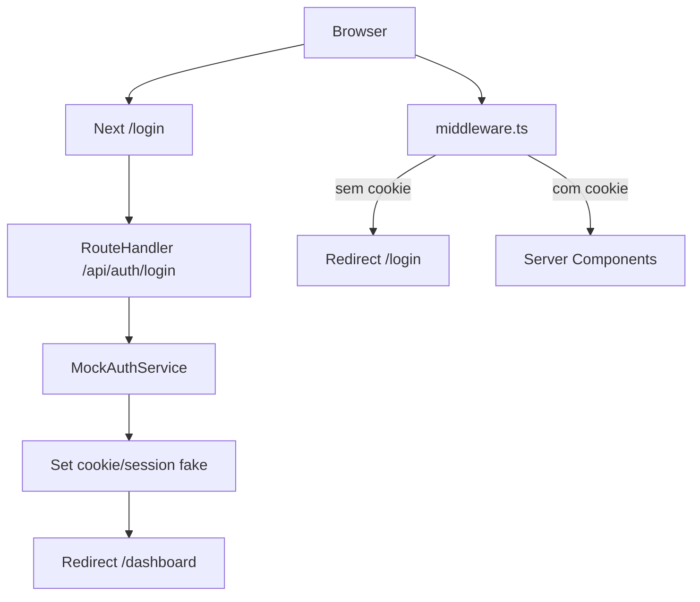

# Plano de implementação do frontend (dados mockados)

## Documentos do projeto

Consultar durante a implementação:

| Documento                                            | Uso                                                                                        |
| ---------------------------------------------------- | ------------------------------------------------------------------------------------------ |
| [docs/ARCHITECTURE.md](docs/ARCHITECTURE.md)         | Visão do sistema, decisões (cookie, Server Components, URL state), fluxo de auth           |
| [docs/CLAUDE.md](docs/CLAUDE.md)                     | Stack, estrutura de pastas, exemplos de código (api, middleware, tipos)                    |
| [docs/BACKEND_CONTRACT.md](docs/BACKEND_CONTRACT.md) | Contrato da API: query params, formatos de resposta, tipos de domínio (status, severidade) |
| [docs/REQUIREMENTS.md](docs/REQUIREMENTS.md)         | Requisitos funcionais (RF-01 a RF-05) e não funcionais                                     |
| [docs/IMPLEMENTATION.md](docs/IMPLEMENTATION.md)     | Detalhes de implementação, se houver                                                       |

O mocks em `api-mock.ts` e os tipos em `types.ts` devem seguir o contrato em `docs/BACKEND_CONTRACT.md` para facilitar a troca pelo backend real.

## Objetivos

- **Construir o frontend completo do Painel do Gestor** (login, dashboard, clientes, detalhe de cliente, agent-status) em **Next.js 14 App Router**, com **UI polida em TailwindCSS**.
- **Usar dados mockados temporariamente**, mas **preservando a mesma forma de consumo** que será usada com o backend FastAPI.
- **Planejar o fluxo de autenticação** desde já (login/logout, middleware, cookies), com modo mock agora e pronto para trocar para o backend real depois.

## Arquitetura geral do frontend

- **Stack**:
  - Next.js 14 (App Router, `src/app`), TypeScript, TailwindCSS.
  - Padrão de pastas conforme `[CLAUDE.md](c:/Users/mateu/Documents/brokerAI-painel-gestor/brokerAI-painel-gestor/CLAUDE.md)` e visão de sistema em `[docs/ARCHITECTURE.md](c:/Users/mateu/Documents/brokerAI-painel-gestor/brokerAI-painel-gestor/docs/ARCHITECTURE.md)`.
- **Principais diretórios/arquivos a criar**:
  - `src/app/layout.tsx`: layout raiz, tema Tailwind, fonte, `<html lang="pt-BR">` etc.
  - `src/app/page.tsx`: redireciona para `/dashboard`.
  - `src/app/login/page.tsx`: página de login (Client Component) com formulário.
  - Layout compartilhado (sidebar + header) para dashboard, clientes e agent-status: usar **route group** `src/app/(painel)/layout.tsx` com rotas `(painel)/dashboard/`, `(painel)/clients/`, `(painel)/agent-status/`, para evitar duplicar o layout em três lugares.
  - `src/app/(painel)/dashboard/page.tsx`: página de resumo (Server Component).
  - `src/app/(painel)/clients/page.tsx`: lista de clientes (Server Component + componentes client para busca/paginação).
  - `src/app/(painel)/clients/[id]/page.tsx`: detalhe do cliente (Server Component).
  - `src/app/(painel)/agent-status/page.tsx`: status do agente (Server Component).
  - `loading.tsx` e `error.tsx` em cada rota que faz fetch: `dashboard/`, `clients/`, `clients/[id]`.
  - `src/app/api/auth/login/route.ts`, `src/app/api/auth/logout/route.ts`: rotas de auth (mock agora, real depois).
  - `src/middleware.ts`: proteção de rotas baseada em cookie/sessão.
  - `src/lib/types.ts`: tipos conforme especificado em `[CLAUDE.md](c:/Users/mateu/Documents/brokerAI-painel-gestor-brokerAI-painel-gestor/CLAUDE.md)`.
  - `src/lib/api.ts`: camada de acesso a dados com interface única, que hoje lê mocks e amanhã chama o FastAPI.
  - `src/lib/api-mock.ts`: implementação concreta mockada da interface de dados.
  - `src/components/*.tsx`: componentes de UI (cards, tabelas, listas) reutilizáveis.

## Estratégia de mocks (sem backend)

- **Interface estável de dados**:
  - Definir contratos em `src/lib/types.ts` exatamente como serão retornados pelo backend.
  - Definir interface de acesso em `src/lib/api.ts` (por ex.: `api.summary`, `api.clients`, `api.clientFull`, `api.agentStatus`).
- **Implementação mock**:
  - Criar `src/lib/api-mock.ts` com funções que implementam as mesmas assinaturas de `api.ts`, mas retornam **dados em memória** (arrays/objetos TypeScript) ou pequenos delays com `Promise`/`setTimeout` para simular latência.
  - `src/lib/api.ts` exportará `api` delegando internamente para `api-mock.ts` enquanto não houver backend.
  - Manter os mesmos nomes e **formato de resposta** do backend (`summary`, `clients` com `skip`/`limit`/`search`, `clientFull`, `agentStatus` com `active_claims`/`active_onboardings`/`total_active`) conforme [docs/BACKEND_CONTRACT.md](docs/BACKEND_CONTRACT.md).
  - Lista de clientes: `api.clients({ skip, limit, search })` com `limit` default 50; mocks devem aplicar filtro por `search` (nome/telefone) e paginação por `skip`/`limit`.
- **Possível uso de MSW depois** (opcional):
  - Planejar a pasta `tests`/`mocks` para futura adoção de MSW em testes, mas **não obrigatório** neste primeiro ciclo.

## Fluxo de autenticação (mock agora, real depois)

- **Camadas planejadas** (seguindo `[CLAUDE.md](c:/Users/mateu/Documents/brokerAI-painel-gestor-brokerAI-painel-gestor/CLAUDE.md)` e `[ARCHITECTURE.md](c:/Users/mateu/Documents/brokerAI-painel-gestor/brokerAI-painel-gestor/ARCHITECTURE.md)`):

- **Implementação mock**:
  - `src/app/api/auth/login/route.ts`:
    - Recebe email/senha.
    - Valida de forma simples (ex.: `admin@brokerai.com` / `123456`) e, se ok, grava **cookie de sessão fake** (`access_token=fake-token`) ou usa o `NextResponse.cookies` para marcar o usuário logado.
    - Em modo mock, **não chamar FastAPI**.
  - `src/app/api/auth/logout/route.ts`:
    - Remove o cookie/sessão fake e redireciona para `/login`.
  - `src/middleware.ts`:
    - Usa o cookie `access_token` para decidir redirecionamentos, mas sem validar JWT.
- **Troca futura para backend real**:
  - Quando o backend estiver pronto, trocar apenas a implementação de `login/route.ts` e `logout/route.ts` para chamarem o FastAPI, mantendo a mesma interface para o restante do app.
- **Middleware**: o `matcher` deve incluir `/dashboard`, `/clients`, `/agent-status` e `/login`; a rota raiz `/` não deve ser protegida para que o redirect de `page.tsx` para `/dashboard` funcione.

## Telas e componentes (UI polida)

### 1. Layout principal

- `**src/app/layout.tsx`**:
  - Configurar HTML base, fonte global, Tailwind, tema claro padrão.
- `**src/app/(painel)/layout.tsx`** (route group: compartilha layout para `/dashboard`, `/clients`, `/agent-status`):
  - Sidebar fixa à esquerda com:
    - Logo/título (BrokerAI Painel do Gestor).
    - Navegação: Dashboard, Clientes, Status do agente.
  - Header superior com:
    - Título da página atual.
    - Ações rápidas (ex.: botão de logout).
  - Conteúdo com grid responsivo e espaçamento consistente.

### 2. Página `/login`

- **Comportamento**:
  - Client Component.
  - Formulário com campos `email` e `senha`, validação básica (required, formato de email).
  - Ao enviar, chama `POST /api/auth/login` (mock), trata erros (mensagem amigável) e, em caso de sucesso, redireciona para `/dashboard`.
- **UI**:
  - Card centralizado, com título, subtítulo explicando o sistema.
  - Botão com estado de loading (desabilitado enquanto envia).

### 3. Página `/dashboard`

- **Dados consumidos (via `api.summary` e, se desejado, mocks adicionais)**:
  - `DashboardSummary` (7 métricas), mas UI foca em 4 principais + lista de vencimentos.
- **Componentes**:
  - `StatCard.tsx`:
    - Recebe título, valor, ícone opcional.
    - Usado para: total de clientes, apólices ativas, renovações pendentes, sinistros em aberto.
  - `ExpiryAlert.tsx`:
    - Recebe dados de apólices por faixa de vencimento (30d, 60d, 90d).
    - Lista com badges coloridas (🔴, 🟡, 🟢) e contagens.
- **Loading/Error**:
  - `src/app/dashboard/loading.tsx`: skeleton com cards cinzas pulsando.
  - `src/app/dashboard/error.tsx`: mensagem de erro com botão de tentar novamente.

### 4. Página `/clients`

- **Dados**:
  - Lista de `ClientResponse[]` vinda de `api.clients({ skip, limit: 50, search })` (mock). CPF exibido mascarado (ex.: `***.210.318-`**) conforme [docs/BACKEND_CONTRACT.md](docs/BACKEND_CONTRACT.md).
- **Busca/paginação**:
  - Server Component recebe `searchParams`: `search`, `page` (derivar `skip = (page - 1) * 50`).
  - Componente de busca `SearchInput` (Client Component):
    - Usa `useRouter()` para atualizar a URL com debounce de 300 ms.
  - Componente `Pagination` (Client Component):
    - Controla `page` ou `skip` via `searchParams` na URL.
- **Tabela**:
  - `ClientTable.tsx` (Server Component):
    - Colunas: Nome, CPF (mascarado), Telefone, Data de cadastro.
    - Cada linha é clicável e leva para `/clients/[id]`.
- **Loading/Error**:
  - `src/app/clients/loading.tsx` e `src/app/clients/error.tsx` similares ao padrão do dashboard.

### 5. Página `/clients/[id]`

- **Dados**:
  - `ClientFull` vindo de `api.clientFull(id)` (mock).
- **Seções**:
  - Cabeçalho com dados do cliente (nome, CPF, contatos, etc.).
  - `PolicyList.tsx`: lista de apólices (número, tipo, vigência, status, prêmio).
  - `ClaimList.tsx`: lista de sinistros (tipo, severidade, status, datas).
  - `RenewalList.tsx`: lista de renovações (status, intenção, último contato, contagem de contatos).
- **UI**:
  - Layout em colunas/cards, responsivo.
  - Tags/badges para status (cores diferentes por status).
- **Loading/Error**:
  - `src/app/(painel)/clients/[id]/loading.tsx` e `error.tsx`. Tratar 404 quando `api.clientFull(id)` falhar (cliente não encontrado): exibir mensagem amigável ou usar `notFound()` do Next.js.

### 6. Página `/agent-status`

- **Dados**:
  - Resposta no formato de [docs/BACKEND_CONTRACT.md](docs/BACKEND_CONTRACT.md): `{ active_claims: [{ phone, type, last_updated_at, ttl_seconds }], active_onboardings: [...], total_active }`. Definir tipo `AgentStatusResponse` em `types.ts` e mock em `api-mock.ts` com a mesma estrutura.
- **UI**:
  - Dois blocos: "Conversas de sinistro ativas" e "Onboardings em andamento", com telefone, última atualização e TTL restante (ex.: exibir segundos em "X min" ou "X h").

## Modo desenvolvimento com mocks e troca para API real

- **Configuração atual**:
  - `src/lib/api.ts` importa `api` de `api-mock.ts`.
  - `api-mock.ts` contém todos os dados e funções.
- **Quando o backend estiver pronto**:
  - Criar nova implementação `api-real.ts` que usa `fetch` para `FASTAPI_URL` conforme [docs/CLAUDE.md](docs/CLAUDE.md).
  - Alterar `src/lib/api.ts` para trocar a origem (`api-real` em vez de `api-mock`), sem mudar as páginas/components.

## Ambiente e variáveis

- `**.env.local`** (não versionar): `FASTAPI_URL=http://localhost:8000` — usada só no servidor; sem `NEXT_PUBLIC`_.
- `**.env.example`** (versionar, sem valores sensíveis): documentar `FASTAPI_URL` para quem for clonar o repositório.
- **Pré-requisitos**: Node 18+, `npm install`, `npm run dev` para rodar em `http://localhost:3000`. Com mocks, o app funciona sem backend; com backend, configurar `FASTAPI_URL` no `.env.local`.

## Considerações de qualidade

- **Tipos**: sempre usar `import type` para tipos, sem `any`, seguindo as interfaces de `types.ts`.
- **Padrões de código**: strings em single quotes, layout responsivo, uso consistente de Tailwind.
- **Acessibilidade**: labels em formulários, contrastes adequados, foco visível em botões/links.

## Boas práticas de versionamento e GitHub

- **Referências**:
  - Regras funcionais e de arquitetura em [docs/ARCHITECTURE.md](docs/ARCHITECTURE.md).
  - Contrato da API em [docs/BACKEND_CONTRACT.md](docs/BACKEND_CONTRACT.md). Plano de funcionalidade (backend) em `C:\Users\mateu\Documents\brokerAI\docs\plans\2026-03-10-feat-painel-gestor-plan.md` (repositório externo).
- **Branches de trabalho**:
  - Manter `main` sempre estável.
  - Para cada fase ou grupo de tarefas (por exemplo, `infra-basic`, `auth-mock`, `dashboard-ui`), criar branches como `feature/infra-basic`, `feature/auth-mock`, etc.
- **Commits constantes e pequenos**:
  - Preferir commits menores e frequentes, por tarefa lógica (ex.: “configurar Tailwind”, “adicionar layout base do dashboard”, “mock de api.summary”).
  - Evitar commits gigantes misturando refatoração, UI e lógica no mesmo commit.
- **Mensagem de commit**:
  - Usar um padrão simples, descritivo e em português, por exemplo:
    - `feat: criar página de dashboard com dados mockados`
    - `feat: implementar fluxo de login mockado`
    - `chore: configurar Tailwind e layout base`
    - `fix: ajustar máscara de CPF na lista de clientes`
  - Focar sempre **no porquê/o que** mudou, não em detalhes de implementação.
- **Commit ao final de cada TODO**:
  - Ao concluir um TODO, fazer **um commit** que fecha essa entrega (podem existir commits intermediários durante a tarefa).
  - Mensagem sugerida por TODO (usar exatamente ao finalizar):
    - `infra-basic` → `feat: criar infraestrutura base do app`
    - `auth-mock` → `feat: implementar fluxo de autenticação mockado`
    - `dashboard-ui` → `feat: criar página de dashboard com dados mockados`
    - `clients-list` → `feat: implementar lista de clientes com busca e paginação`
    - `client-detail` → `feat: criar detalhe de cliente com apólices e sinistros`
    - `agent-status` → `feat: implementar página de status do agente`
    - `ux-polish` → `chore: refinar estados de loading e feedbacks de erro`
- **Integração com o plano**:
  - Cada TODO do plano (`infra-basic`, `auth-mock`, etc.) deve ser refletido em uma sequência de commits que caminham claramente nessa direção.
  - Ao finalizar uma fase (por exemplo, “Dashboard completo”), abrir um Pull Request descrevendo:
    - Escopo (quais telas/fluxos foram implementados).
    - Referências a documentos (`ARCHITECTURE.md`, plano em `docs/plans`).
    - Como testar no ambiente local.

## Fases de entrega

Cada fase termina com **um commit** usando a mensagem indicada.

| Fase | Escopo                                                                                                                                   | Commit ao finalizar                                         |
| ---- | ---------------------------------------------------------------------------------------------------------------------------------------- | ----------------------------------------------------------- |
| 1    | Infraestrutura básica: setup Next.js/Tailwind, `layout.tsx`, `page.tsx`, `middleware.ts`, tipos em `types.ts`, `api.ts` + `api-mock.ts`. | `feat: criar infraestrutura base do app`                    |
| 2    | Autenticação mock: rotas `/api/auth/login`, `/api/auth/logout`, fluxo de login/logout, middleware com cookie fake.                       | `feat: implementar fluxo de autenticação mockado`           |
| 3    | Dashboard completo: UI polida, mocks de summary e vencimentos, loading/error.                                                            | `feat: criar página de dashboard com dados mockados`        |
| 4    | Clientes (lista + busca + paginação): tabela, busca com debounce, paginação via URL, mocks.                                              | `feat: implementar lista de clientes com busca e paginação` |
| 5    | Detalhe do cliente: seções completas com todas as listas, mocks.                                                                         | `feat: criar detalhe de cliente com apólices e sinistros`   |
| 6    | Agent status: listas com dados mockados, UI polida.                                                                                      | `feat: implementar página de status do agente`              |
| 7    | Refinos visuais e UX: hovers, skeletons mais refinados, mensagens de erro melhores.                                                      | `chore: refinar estados de loading e feedbacks de erro`     |

